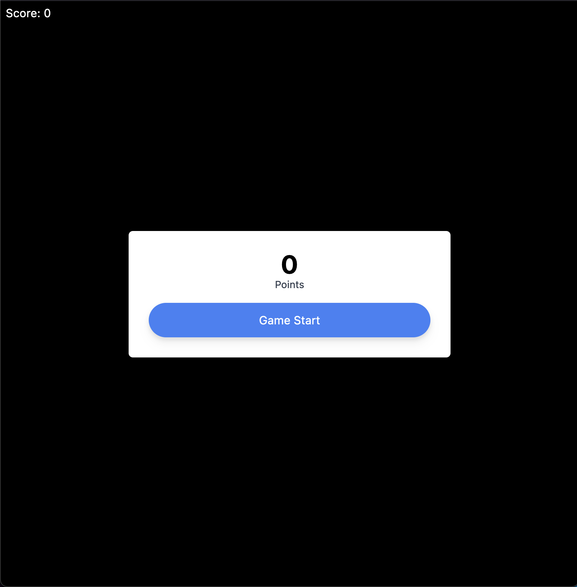
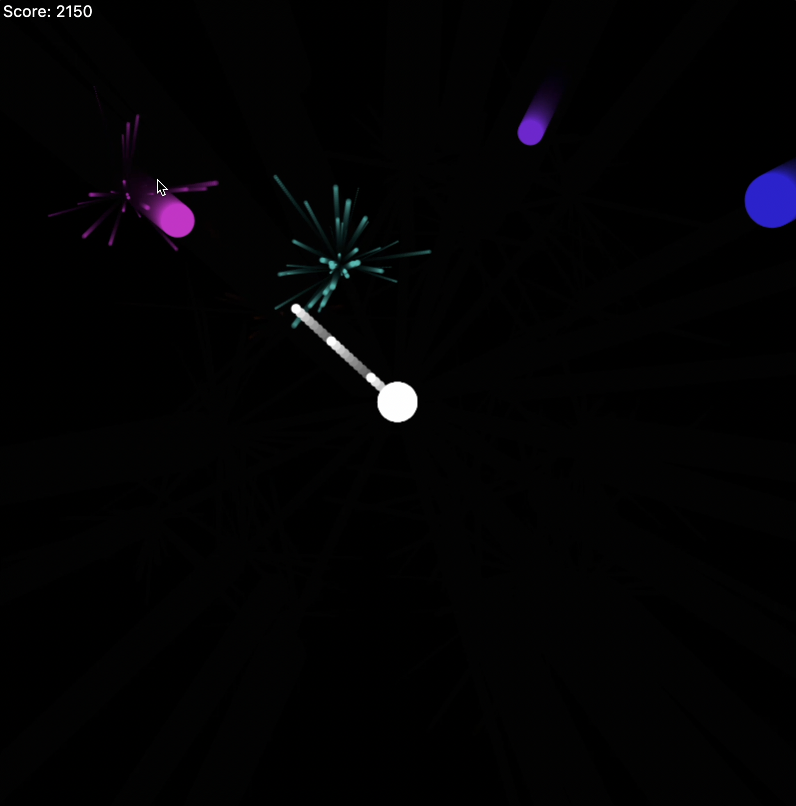
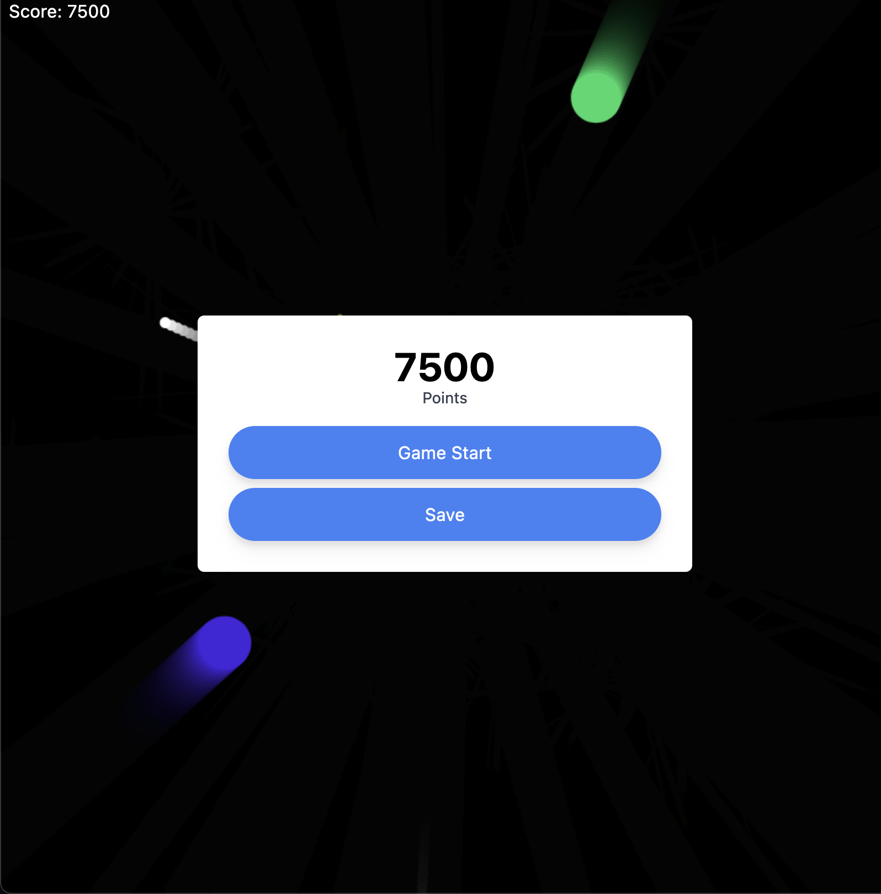
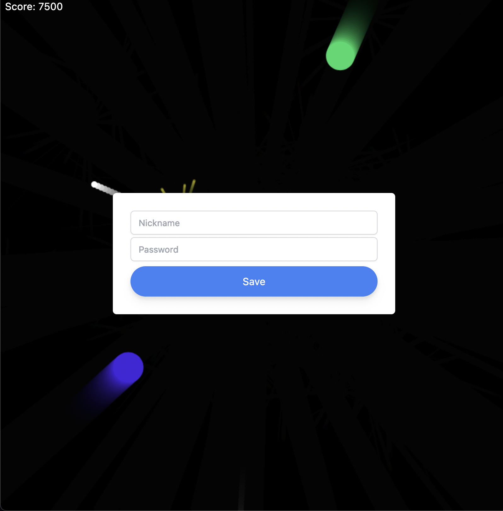
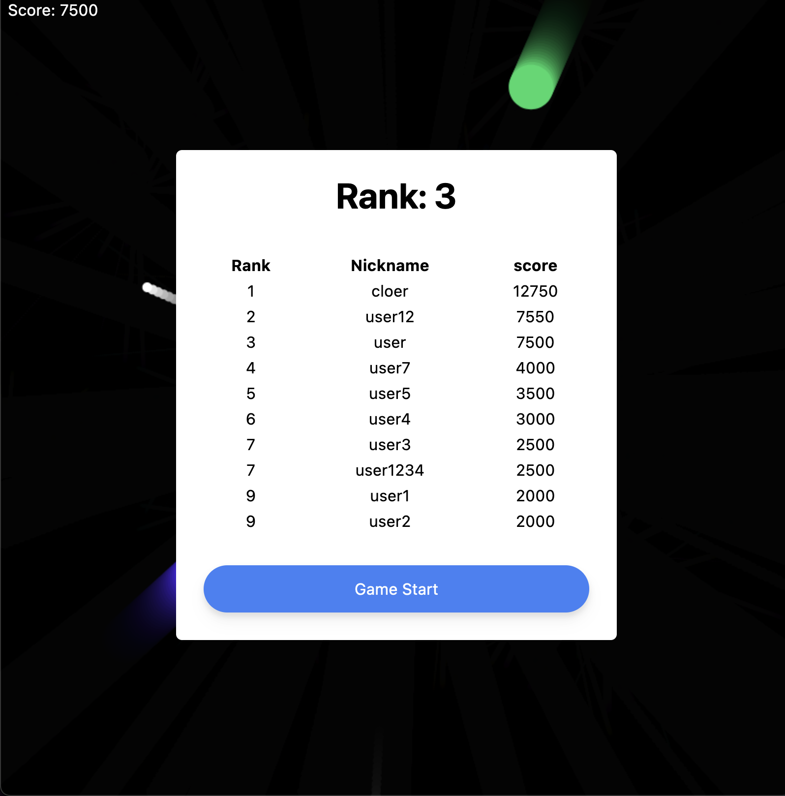

# Shooting Game (Toy Project 1)

It's a simple shooting game. You can get a score and save it.

When you hit an enemy you will get points. When a big enemy is hit, a small enemy appears. Enemies are getting faster.

<br>
<br>

# Screen shots

**Start**


**Play**


**Game Over**


**Login**


**Score Board**


<br>
<br>

# Using ...

### Client

- vanillaJS
- canvas API
- fetch API
- tailwindcss

### Server

- NodeJS(express)
- MySQL

<br>
<br>

# File structure

```
.
├── README.md
├── img4README
├── package-lock.json
├── client
│   ├── index.html
│   └── src
│       ├── fetch.js
│       └── shooting-game.js
└── server
    ├── app.js
    ├── config
    │   ├── express.js
    │   └── router.js
    ├── package-lock.json
    ├── package.json
    ├── src
    │   ├── lib
    │   │   ├── dbSecret.js
    │   │   └── responseMessage.js
    │   ├── login
    │   │   ├── loginController.js
    │   │   ├── loginDao.js
    │   │   └── loginProvider.js
    │   └── scoreBoard
    │       ├── rankController.js
    │       ├── rankDao.js
    │       └── rankProvider.js
    └── test.rest
```

<br>
<br>

# TODO

- modularize `shooting-game.js`
